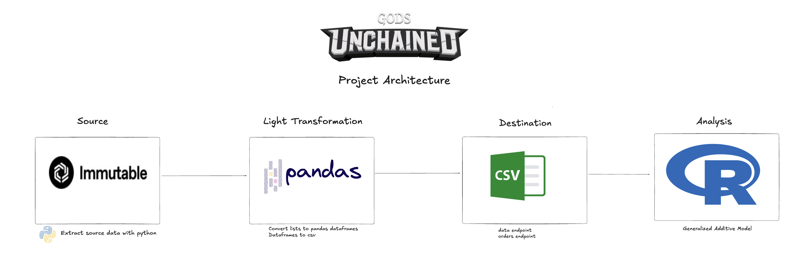
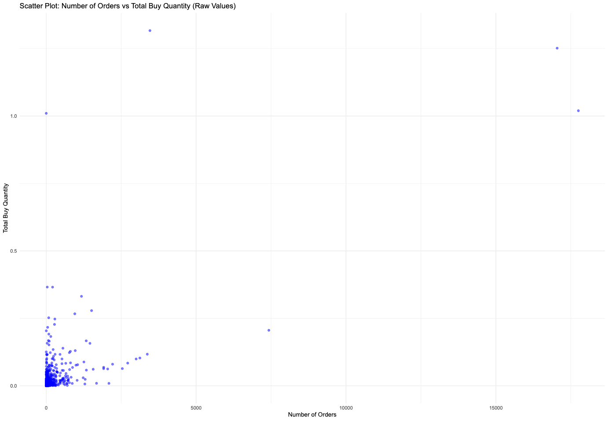
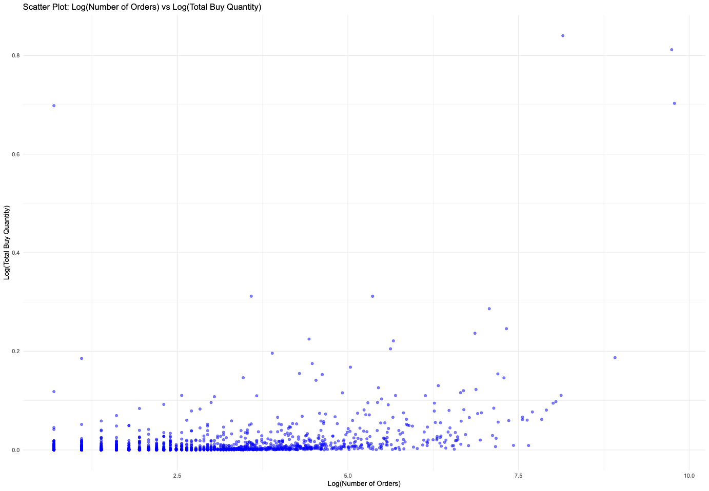
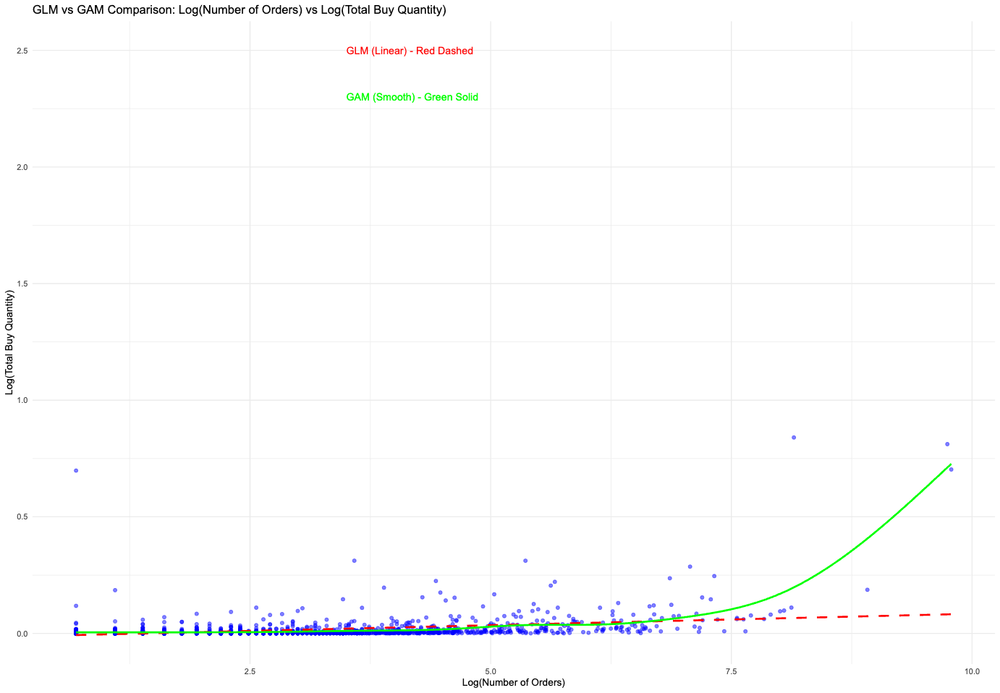
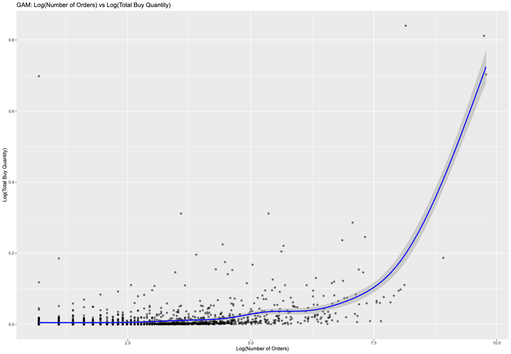
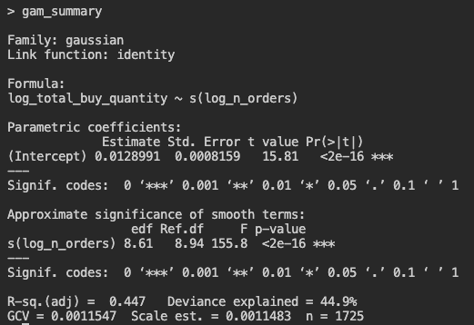
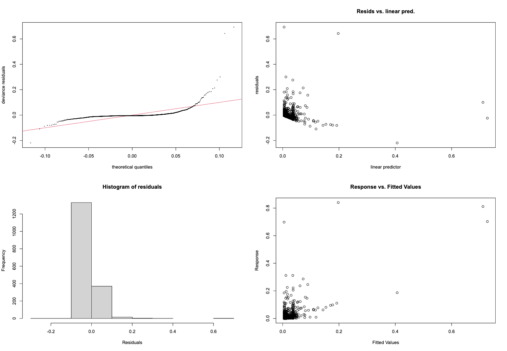
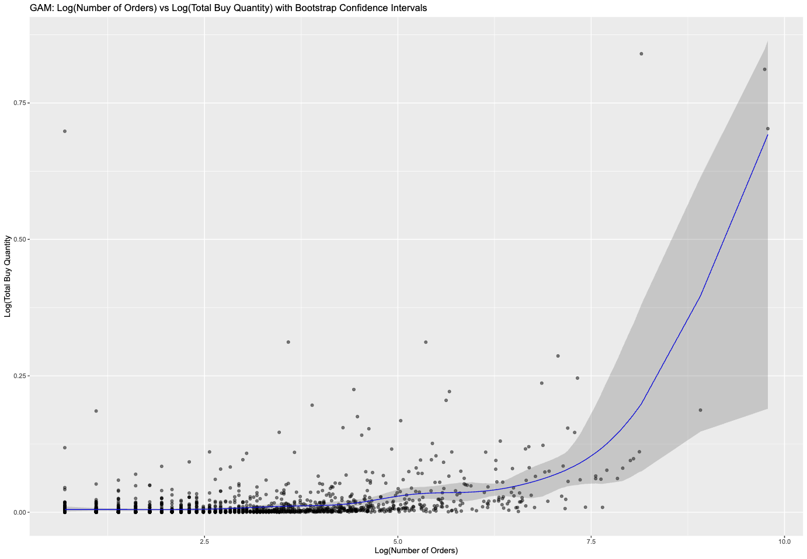

# Immutable_X

# Table of Contents

- [Immutable\_X](#immutable_x)
- [Table of Contents](#table-of-contents)
- [Goal](#goal)
- [Architecture Diagram](#architecture-diagram)
- [Codebase](#codebase)
- [Getting Started](#getting-started)
- [Analysis](#analysis)
- [Discussion + Next Steps](#discussion--next-steps)

# Goal

This project was designed to extract data from Immutable X's highest revenue generating project Gods Unchained Cards to hopefully fit a linear model to inform user segmentation strategies. (SPOILER: I failed in doing so...but have a good starting point for next steps)

# Architecture Diagram

# Codebase
  - `src/immutable/extract`: Holds the extraction logic for getting data from Immutable X
    - `deposits.py`: chain-wide deposits data
    - `orders.py`: Gods Unchained Cards order-specific data
    - `utility.py`: Helper functions shared across classes
  - `src/immutable/pipeline`: Main function that runs the extraction logic
    - `immutable_pipeline.py`: runs data extraction from the deposits and orders endpoints
  - `src/immutable/test`: Integration testing
    - `test_extract.py`: tests that we receive a non-null response from the various endpoints
  - `src/immutable/analysis`
    - `deposits.csv`: the deposits CSV that is created 
    - `orders.csv`: the orders CSV that is created
    - `regression_analysis.R`: R analysis covering exploration, model fitting, and diagnostics

# Getting Started 

Before you begin, make you have the following: 

1. Python installed 
2. R installed 
3. Create and activate a virtual enviornment 
4. python -m venv venv
source venv/bin/activate  # On macOS/Linux
.\venv\Scripts\activate   # On Windows
5. pip install -r requirements.txt
6. Open R or RStudio in the root directory of this repository (the same folder containing renv.lock).
7. You'll need to have the renv package installed if you haven't already. Run install.packages("renv")
8. Run renv::restore() 

Once this is done, you should be able to run each section of the code without issue. 

# Analysis 

Starting with exploratory data analysis, I sought to understand the relationship between the number of orders placed by users and the total buy quantity. The idea was to be able to potentially figure out how to segment users based on user engagement and their subsequent economic contribution.

Heres an inital scatter plot where I was trying to ascertain the relationship between the predictor and response variables: 

Much of the data was concentrated in the lower left-hand corner, where both the number of orders and total buy quantity were relatively small. However, as the total buy quantity increased, there was a noticeable upward trend, suggesting a positive relationship between the two variables.

The initial scatter plot revealed a clear positive trend between the number of orders and total buy quantity, but the relationship was not perfectly linear. To address this, I applied a log transformation to both variables. This transformation helped to linearize the relationship and stabilize the variance, making the data more suitable for modeling.

Here's the scatter plot now log transformed: 

Despite the log transformation, I encountered challenges with fitting a simple linear model. The residuals showed clear deviations from normality, and patterns emerged that indicated the linear model was failing to capture the non-linear nature of the relationship. In an effort to improve the model, I tried increasingly more complex linear approaches, including generalized linear models (GLM). Unfortunately, the GLM still struggled to represent the data effectively, as the assumptions of linearity and homoscedasticity remained violated.

Recognizing that the linear models were inadequate, I turned to a generalized additive model (GAM). Unlike linear models, GAMs use smooth functions to capture relationships that are not strictly linear, making them well-suited for data with complex, non-linear patterns.

The comparison between the GLM and GAM fits is shown in the following chart:

The chart highlights the key difference between the two models. The GLM (red dashed line) attempts to fit the data with a strict linear relationship, which fails to account for the subtle curvature in the trend. In contrast, the GAM (green solid line) captures the non-linear nature of the relationship more effectively by using smooth functions. This flexibility allowed the GAM to better follow the patterns in the data, particularly in areas where the GLM visibly deviated from the observed points.

Ultimately, the GAM provided a much better fit for the data, capturing the underlying relationship between the number of orders and total buy quantity in a way that the linear models could not. This realization led me to proceed with the GAM for further analysis.
Here is the fit for the GAM model by itself:

To further evaluate the GAM, I examined its summary statistics seen here:

The parametric coefficients validated the baseline value of the log total buy quantity when the log number of orders is zero. The small standard error and significant p-value indicated that the intercept was reliable.

The smooth term for the log number of orders had an estimated degrees of freedom of 8.61. This confirmed a non-linear relationship, as a strictly linear relationship would have resulted in an estimated degrees of freedom of one. The value of 8.61, just below the upper bound of 8.94, suggests the model captures the variations in the data without overfitting. The F-value for the smooth term was 155.8, indicating that the smooth term explained a significant portion of the variability in the response variable. The associated p-value further confirmed the statistical significance of the smooth term.

For model fit, I looked at the adjusted R-squared value and the generalized cross-validation score. The adjusted R-squared value was 0.447, meaning that 44.7 percent of the variability in the response variable was explained by the model. While this value is not extremely high, it is still a reasonable result given the noise in the data. The generalized cross-validation score was 0.0011547, which is low and indicates that the model has good predictive power.

To better understand the quality of the model, I generated diagnostic plots, including the QQ plot of residuals, residuals versus the linear predictor, a histogram of residuals, and residuals versus fitted values.

The QQ plot showed that the residuals deviate from normality, particularly in the tails, which exhibit skewness. This suggests that the model struggles to capture the variability in certain regions of the data. The residuals versus linear predictor plot displayed a slight funnel shape where residuals fan out as the fitted values increase, indicating heteroscedasticity, or non-constant variance. The histogram of residuals revealed a skew toward zero, with a high concentration of small residuals and some outliers, which further suggested non-normality. Finally, the response versus fitted values plot showed that many points were clustered at lower fitted values, with increasing deviations for higher values. This indicates that the model has difficulty making accurate predictions for extreme or higher values in the dataset.

While these diagnostics highlight certain limitations of the GAM model, such as non-normality of residuals and heteroscedasticity, the model still performed better than the linear models. Additionally, understanding where the model struggles provides valuable insights for future improvements. Outliers in the dataset likely have a disproportionate effect on the model, and addressing them could improve the fit. Another potential improvement would be to use a different family, such as Gamma or Quasi, to better handle the heteroscedasticity.

To quantify the uncertainty in the GAM model's predictions, I performed bootstrapping. Bootstrapping involves repeatedly resampling the data with replacement, refitting the model for each resample, and aggregating the predictions to calculate confidence intervals. This approach provides a robust measure of uncertainty, particularly in regions where the data is sparse.

The bootstrapped confidence intervals are narrow in regions where the data is denser, which indicates that the model's predictions are reliable in these areas. However, as the fitted values increase, the confidence intervals widen, reflecting higher uncertainty in these regions. This is likely due to the presence of outliers and fewer data points at the extremes. Despite this, the majority of the data falls within the range where predictions are reliable. The widening intervals at the extremes highlight where we need to exercise caution with the predictions and provide an opportunity for further refinement of the model.

In conclusion, the GAM model successfully captured the non-linear relationship between the number of orders and total buy quantity, performing better than the linear alternatives. While there are areas where the model could be improved, such as addressing outliers and heteroscedasticity, it remains a reasonable approach for this dataset. Bootstrapping further validated the model by quantifying uncertainty, helping to identify where the model performs well and where caution is needed.

# Discussion + Next Steps 
The results of our analysis provide important insights into user purchasing behavior for the Gods Unchained Cards collection on Immutable X. By exploring the relationship between the number of orders and the total quantity of assets purchased, we gain a clearer understanding of user engagement and economic activity within the marketplace. Our analysis identified a non-linear relationship between the log-transformed number of orders and the log-transformed total buy quantity. The key takeaway here is that users who place a higher number of orders tend to purchase disproportionately larger quantities of assets. This suggests that the marketplace has a subset of highly engaged “power users” who account for a significant portion of the economic activity. These users accumulate more cards and, as a result, exert a greater influence on the secondary market. For Immutable X, identifying these high-order users could allow for targeted strategies or incentives to encourage continued engagement and trading.

While the GAM model effectively captured this non-linear relationship, the diagnostic plots highlighted areas where the model struggles. Specifically, we observed the presence of outliers, non-normal residuals, and heteroscedasticity. The outliers—extreme cases where users have exceptionally high orders or total quantities—may distort the model's performance. These outliers could represent whale users who make significant purchases, speculative trading activity, or bot activity that may disproportionately affect the market. Additionally, heteroscedasticity in the residuals indicates that the model’s performance varies across the range of fitted values. This means that the predictions are less reliable for users with very high activity levels, where variability in the data increases significantly.

Despite these limitations, the bootstrapped confidence intervals provide further context to our model's reliability. In regions where the data is denser, such as for users with low to moderate order volumes, the confidence bands are narrow, suggesting that predictions are reliable. However, as the number of orders increases, the confidence intervals widen significantly, reflecting greater uncertainty. This aligns with our earlier findings and reinforces the need for caution when interpreting predictions for extreme-order users. These users represent both an opportunity and a challenge for the marketplace. On one hand, their activity contributes significantly to overall revenue and liquidity. On the other, their behavior may introduce volatility or manipulation that could destabilize the marketplace.

From a broader perspective, these insights suggest several areas for improvement and strategic direction. Understanding the behavior of power users and segmenting engagement based on order activity can help Immutable X design incentives to retain these critical contributors. At the same time, addressing outliers through further analysis—whether to confirm organic behavior or mitigate speculative trading—could improve market stability. There is also an opportunity to refine policies that promote balanced participation in the marketplace, such as encouraging diversity in trading activity or limiting excessive speculation in low-value assets.

The limitations observed in the GAM model also suggest areas for future analysis. Exploring alternative statistical models, such as Gamma family models or quantile regression, may help address the heteroscedasticity and non-normal residuals observed here. Additionally, a deeper understanding of the outliers—whether through data exploration or exclusion—could help improve the overall fit of the model.

In summary, the GAM model provides a more flexible and accurate representation of the relationship between user orders and total asset purchases compared to linear models. While the model has its challenges, it captures the main trends in the data and provides actionable insights for Immutable X and Gods Unchained and is a jumping off point. Fitting models to real data can be difficult, becaue there can be a lot of noise that makes it difficult. One thing that is great is that their are so many more API's to consume from found here: https://docs.immutable.com/x/reference/#/. The code is set up in a way, where we could easily consume from multiple APIs that might give us a better fit for our models. 